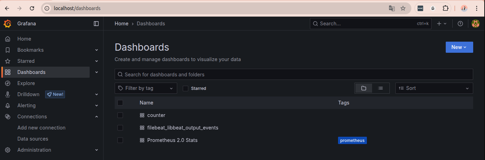

# test-task (Тестовое задание)

*Предполагается что вы запускаете это на Linux Ubuntu (я делал всё на версии 22.04) и у Вас есть уже установленны браузер, docker, ansible.

Для запуска на локальной машине нужно: 
1) скачать этот репозиторий
```
git clone https://github.com/testdevopser/test-task.git
```

2) Зайти в папку test-task и запустить плейбук
````
ansible-playbook playbook.yml -K
````
3) Открыть в браузере
   http://localhost - тут будет Grafana (логин и пароль admin/adminTest#01)
   в  будут в разделе Dashboards 3 дашборда 
   1. counter - показывает общее (кумулятивное) количество логов, которые Filebeat обработал и отправил с момента своего запуска.
   2. filebeat_libbeat_output_events - Запрос rate(filebeat_libbeat_output_events{type="acked"}[5m]) показывает скорость обработки логов (сколько логов в секунду).
   3. Prometheus 2.0 Stats - это я просто стандарный дашборд подгрузил со статистикой прометеуса .
 
Описание
playbook.yml - устанавливает и настраивает 2 вещи:  
- Filebeat для аггрегации и записи логов в "/var/log/test"
- и также оно устанавливает такую штуку как beat-exporter (https://github.com/trustpilot/beat-exporter.git) - это надо чтобы дать метрики prometheus в понятном ему виде. (напрмямую у меня не получилось скормить prometheus вывод filebeat)

```
.
├── docker-compose.yml
├── grafana
│   └── provisioning
│       ├── dashboards
│       │   └── dashboards.yml
│       ├── dashboards_files
│       │   ├── my_dashboard.json
│       │   └── sample.json
│       └── datasources
│           └── prometheus.yml
├── playbook.yml
├── prometheus
│   └── prometheus.yml
├── README.md
└── roles
    ├── beat_exporter
    │   ├── defaults
    │   │   └── main.yml
    │   ├── tasks
    │   │   └── main.yml
    │   └── templates
    │       └── beat-exporter.service.j2
    └── filebeat_docker_logs
        ├── handlers
        │   └── main.yml
        ├── tasks
        │   └── main.yml
        └── templates
            └── filebeat.yml.j2


```
