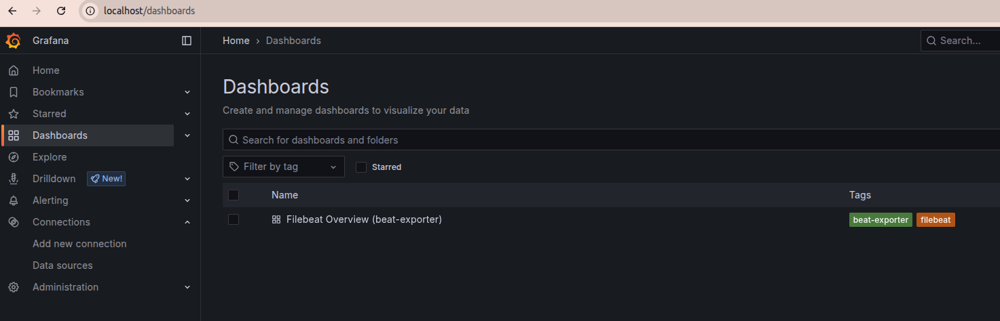

# test-task (Тестовое задание)

## Запуск
*Предполагается что вы запускаете это на десктопе с Linux Ubuntu (я делал всё на версии 22.04) и у Вас есть уже установленны: 
- git
- браузер, 
- docker-compose, 
- ansible.


Для запуска на локальной машине нужно: 
1) скачать этот репозиторий
```
git clone https://github.com/testdevopser/test-task.git
```

2) Зайти в папку test-task 
````
cd test-task
````
и запустить плейбук
````
ansible-playbook playbook.yml -K
````

3) Запустить в этой же папке test-task (в которой находится файл docker-compose.yml) 

```
docker compose up -d
```


4) Открыть в браузере
   http://localhost - тут будет Grafana (логин и пароль дефолтные admin/admin)
   и там должен быть импортирован дашборд 
   
---

## Описание

playbook.yml - устанавливает и настраивает 3 вещи:  
1) Filebeat для получения логов с /var/lib/docker/containers/*/*.log и добавляет docker metadata (включая container_name)
2) Logstash принимает и пишет логи в "/var/log/test" с указанием имени docker контейнера в логе
пример вывода /var/log/test
```
[grafana] logger=context userId=0 orgId=0 uname= t=2025-06-22T10:42:56.537390521Z level=info msg="Request Completed" method=GET path=/ status=302 remote_addr=172.18.0.1 time_ms=0 duration=671.429µs size=29 referer=http://localhost/ handler=/ status_source=server 
[grafana] logger=authn.service t=2025-06-22T10:42:56.541456204Z level=warn msg="Failed to authenticate request" client=auth.client.session error="user token not found" 
[grafana] logger=provisioning.dashboard type=file name=default t=2025-06-22T10:43:00.120735254Z level=error msg="failed to load dashboard from " file=/etc/grafana/provisioning/dashboards_files/counter.json error="invalid character '\"' after object key:value pair" 
[grafana] logger=authn.service t=2025-06-22T10:43:01.77521334Z level=warn msg="Failed to authenticate request" client=auth.client.session error="user token not found"
```
3) и также оно устанавливает такую штуку как [beat-exporter] (https://github.com/trustpilot/beat-exporter.git) - это надо чтобы дать метрики prometheus в понятном ему виде. (напрмямую у меня не получилось скормить prometheus вывод filebeat). 
Также допилил ещё и systemd сервис на его основе (/etc/systemd/system/beat-exporter.service)
````
[Unit]
Description=Trustpilot Beat Exporter for Prometheus
After=network.target

[Service]
ExecStart=/usr/local/bin/beat-exporter -beat.uri "http://localhost:5066" -web.listen-address "0.0.0.0:9479"
Restart=always
User=root

[Install]
WantedBy=multi-user.target

````
Он запускает бинарник beat-exporter это небольшой прокси, который опрашивает Filebeat по его встроенному HTTP API и экспортирует эти данные в формате Prometheus metrics. Так что этот beat-exporter работает как прокладка между Filebeat API и самим Prometheus.

---

## Описание дашборда 


   Тут использованы label_values для заполнения переменных. Панель мониторинга состоит из трех строк: краткие ключевые показатели эффективности, пропускная способность событий и статус ошибок/очереди, чтобы обеспечить четкое представление всех основных показателей.


### Ключевые особенности этого дашборда:
 - Обзор KPI: Верхняя панель показывает самые важные показатели: статус, время работы, количество активных горутин и общее количество обработанных событий.
 - Производительность конвейера: Графики показывают скорость обработки событий (опубликованные, подтвержденные, отфильтрованные), что помогает выявить "узкие места".
- Ошибки и очередь: Отдельные панели для отслеживания ошибок отправки и количества событий в очереди на отправку (показатель задержек).
- Потребление ресурсов: Графики использования CPU и памяти.
Активность Harvester и Registrar: Показывает, сколько файлов читается в данный момент и как часто обновляется состояние.
Секция для модуля Auditd: Сворачиваемая секция для метрик, специфичных для модуля auditd.


---
## Метрики Filebeat Exporter


Этот документ описывает метрики, предоставляемые Filebeat Exporter, сгруппированные по категориям для удобства мониторинга.

Метрики можно посмотреть по адресу http://localhost:9479/metrics


---

### 1. Информация об Exporter и цели

Эти метрики предоставляют базовую информацию о самом `beat-exporter` и о подключенном экземпляре Filebeat.

| Метрика                      | Описание                                                                  |
| :--------------------------- | :------------------------------------------------------------------------ |
| `beat_exporter_build_info`   | Версия и информация о сборке самого `beat-exporter` (не Filebeat).        |
| `beat_exporter_target_info`  | Информация о подключённом Beat (например, имя `filebeat`, версия).        |
| `filebeat_up`                | Показывает, работает ли Filebeat (1 — работает, 0 — недоступен).          |
| `filebeat_uptime_seconds_total` | Сколько Filebeat работает (в секундах).                                  |

---

### 2. Аудит (auditd)

Эти метрики актуальны, если Filebeat собирает логи аудита ядра.

| Метрика                             | Описание                                    |
| :---------------------------------- | :------------------------------------------ |
| `filebeat_auditd_kernel_lost`       | Сколько сообщений потеряно ядром.           |
| `filebeat_auditd_reassembler_seq_gaps` | Пропуски в последовательности сообщений.    |
| `filebeat_auditd_received_msgs`     | Сколько сообщений аудита получено.          |
| `filebeat_auditd_userspace_lost`    | Сколько сообщений потеряно в userspace.     |

---

### 3. CPU

Метрики использования CPU процессом Filebeat.

| Метрика                       | Описание                                                                |
| :---------------------------- | :---------------------------------------------------------------------- |
| `filebeat_cpu_ticks_total`    | Сумма тиков CPU, потраченных Filebeat (разделено по режимам `user` и `system`). |
| `filebeat_cpu_time_seconds_total` | То же самое, но в секундах.                                             |

---

### 4. События Filebeat

Метрики, связанные с обработкой событий и состоянием харвестеров Filebeat.

| Метрика                         | Описание                                                               |
| :------------------------------ | :--------------------------------------------------------------------- |
| `filebeat_filebeat_events`      | Количество событий по статусам: `active` (обрабатываются сейчас), `added` (добавлены), `done` (завершены). |
| `filebeat_filebeat_harvester`   | Состояние харвестеров (читалок файлов): сколько `started`, `closed`, `running`, `open_files`, `skipped`. |
| `filebeat_filebeat_input_log`   | События по входным файлам: сколько файлов `renamed`, сколько `truncated` (усечены). |

---

### 5. Конфигурация

Метрики, отражающие состояние и перезагрузки конфигурации Filebeat.

| Метрика                        | Описание                                                    |
| :----------------------------- | :---------------------------------------------------------- |
| `filebeat_libbeat_config`      | Состояние модулей (запущено, остановлено, запущено заново). |
| `filebeat_libbeat_config_reloads_total` | Сколько раз перезагружалась конфигурация.                 |

---

### 6. Выход (Output)

Метрики, связанные с отправкой данных из Filebeat во внешние системы.

| Метрика                           | Описание                                                               |
| :-------------------------------- | :--------------------------------------------------------------------- |
| `filebeat_libbeat_output_events`  | События на выходе: сколько `acked` (подтверждено), `active`, `batches` (пакетов), `dropped`, `duplicates`, `failed`. |
| `filebeat_libbeat_output_read_bytes_total` | Сколько байт прочитано с выхода (обычно 0, Filebeat больше пишет).    |
| `filebeat_libbeat_output_read_errors_total` | Ошибки чтения с выхода.                                                |
| `filebeat_libbeat_output_total`   | Тип выхода (например, `file`, `elasticsearch`).                        |
| `filebeat_libbeat_output_write_bytes_total` | Сколько байт записано.                                                 |
| `filebeat_libbeat_output_write_errors_total` | Ошибки записи.                                                         |

---

### 7. Pipeline

Метрики, описывающие состояние и производительность внутреннего конвейера обработки событий Filebeat.

| Метрика                          | Описание                                                               |
| :------------------------------- | :--------------------------------------------------------------------- |
| `filebeat_libbeat_pipeline_clients` | Сколько клиентов подключено к pipeline.                                |
| `filebeat_libbeat_pipeline_events` | События в pipeline: `active`, `dropped`, `failed`, `filtered`, `published`, `retry`. |
| `filebeat_libbeat_pipeline_queue` | События в очереди pipeline (`acked`).                                  |

---

### 8. Память и ресурсы

Метрики, касающиеся использования памяти и других системных ресурсов процессом Filebeat.

| Метрика                        | Описание                                          |
| :----------------------------- | :------------------------------------------------ |
| `filebeat_memstats_gc_next_total` | Когда будет следующий сборщик мусора.             |
| `filebeat_memstats_memory`     | Всего памяти выделено.                            |
| `filebeat_memstats_memory_alloc` | Сколько памяти сейчас в использовании.             |
| `filebeat_memstats_rss`        | RSS — физическая память, занимаемая процессом.    |
| `filebeat_runtime_goroutines`  | Количество goroutine.                             |

---

### 9. Registrar

Метрики, связанные с механизмом регистратора Filebeat, который отслеживает позицию чтения файлов.

| Метрика                     | Описание                                              |
| :-------------------------- | :---------------------------------------------------- |
| `filebeat_registrar_states` | Состояние регистратора: `cleanup`, `current`, `update`. |
| `filebeat_registrar_writes` | Записи регистратора: успешные, неудачные, всего.      |

---

